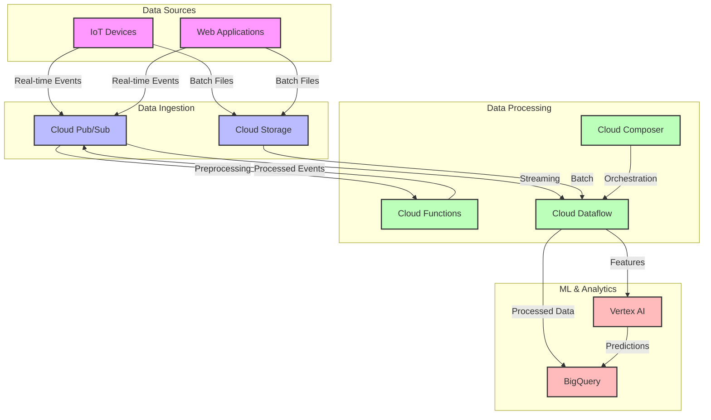

# GCP-Based Streaming & Batch Data Pipeline

## Overview
This project implements a unified batch and streaming data pipeline on Google Cloud Platform (GCP) that processes IoT and web application events in real-time and batch modes. The pipeline includes real-time event processing, batch data processing, and machine learning inference capabilities.

## Architecture



## Architecture Components

### Data Ingestion
- **Cloud Pub/Sub**: Handles real-time event streaming from IoT devices and web applications
- **Cloud Storage**: Stores raw and processed data, batch files, and failed events

### Data Processing
- **Cloud Dataflow**: Processes both streaming and batch data using Apache Beam
- **Cloud Functions**: Preprocesses events and handles real-time ML inference
- **Cloud Composer**: Orchestrates batch processing workflows using Apache Airflow

### Data Storage & Analytics
- **BigQuery**: Stores processed events with partitioning and clustering for efficient querying
- **Vertex AI**: Provides real-time ML predictions for streaming events

## Prerequisites
- Google Cloud Platform account with billing enabled
- Google Cloud SDK installed and configured
- Python 3.9+ installed
- Required GCP APIs enabled:
  - Cloud Pub/Sub API
  - Cloud Dataflow API
  - BigQuery API
  - Cloud Composer API
  - Vertex AI API
  - Cloud Functions API
  - Cloud Storage API

## Project Structure
```
gcp-streaming-batch-pipeline/
├── terraform/                 # Infrastructure as Code
│   ├── main.tf               # Main Terraform configuration
│   ├── variables.tf          # Terraform variables
│   └── schemas/              # BigQuery schemas
├── dataflow/                 # Dataflow pipeline code
│   └── etl_pipeline.py       # Apache Beam pipeline
├── functions/                # Cloud Functions
│   └── preprocess_data.py    # Event preprocessing function
├── composer/                 # Airflow DAGs
│   └── dag_pipeline.py       # Pipeline orchestration
├── vertex/                   # ML inference
│   └── vertex_inference.py   # Real-time prediction
├── data/                     # Sample data
│   └── sample_event.json     # Example event
├── requirements.txt          # Python dependencies
└── README.md                 # Project documentation
```

## Setup and Deployment

### 1. Initialize Terraform
```bash
cd terraform
terraform init
```

### 2. Configure Variables
Create a `terraform.tfvars` file with your GCP project details:
```hcl
project_id = "your-project-id"
region     = "us-central1"
zone       = "us-central1-a"
```

### 3. Deploy Infrastructure
```bash
terraform apply
```

### 4. Deploy Cloud Functions
```bash
cd functions
gcloud functions deploy preprocess_event \
    --runtime python39 \
    --trigger-topic iot-events \
    --entry-point preprocess_event
```

### 5. Deploy Dataflow Pipeline
```bash
cd dataflow
python etl_pipeline.py \
    --project=YOUR_PROJECT_ID \
    --region=us-central1 \
    --temp_location=gs://YOUR_TEMP_BUCKET/temp \
    --staging_location=gs://YOUR_TEMP_BUCKET/staging \
    --template_location=gs://YOUR_TEMPLATE_BUCKET/templates/streaming_template
```

### 6. Upload Airflow DAG
```bash
gcloud composer environments storage dags import \
    --environment=data-pipeline-composer \
    --location=us-central1 \
    --source=composer/dag_pipeline.py
```

## Testing the Pipeline

### Send Test Event
```bash
gcloud pubsub topics publish iot-events --message="$(< data/sample_event.json)"
```

### Query Results in BigQuery
```sql
SELECT 
    event_type,
    COUNT(*) as event_count,
    AVG(prediction_score) as avg_prediction
FROM `YOUR_PROJECT_ID.events_dataset.events`
WHERE DATE(event_timestamp) = CURRENT_DATE()
GROUP BY event_type
```

## Monitoring and Maintenance

### Monitoring
- Use Cloud Monitoring for pipeline metrics
- Set up alerts for failed events
- Monitor Dataflow job status
- Track BigQuery query performance

### Maintenance
- Regularly check Cloud Storage for failed events
- Monitor BigQuery table partitioning
- Review and update ML models in Vertex AI
- Keep dependencies updated

## Security Considerations
- Use service accounts with minimal required permissions
- Enable VPC Service Controls where appropriate
- Encrypt sensitive data
- Implement proper IAM roles and policies

## Contributing
1. Fork the repository
2. Create a feature branch
3. Commit your changes
4. Push to the branch
5. Create a Pull Request

## License
This project is licensed under the MIT License - see the LICENSE file for details.

## Support
For issues and feature requests, please create an issue in the GitHub repository.

---

## Directory Structure
```bash
gcp-streaming-batch-pipeline/
├── terraform/
│   ├── main.tf
│   ├── variables.tf
│   ├── outputs.tf
│   └── modules/...
├── dataflow/
│   └── etl_pipeline.py
├── functions/
│   └── preprocess_data.py
├── composer/
│   └── dag_pipeline.py
├── vertex/
│   └── vertex_inference.py
├── data/
│   └── sample_event.json
└── README.md
```

---

## Step-by-Step Instructions

### Step 1: Deploy Infrastructure
```bash
cd terraform
terraform init
terraform apply -auto-approve
```
This will create:
- Pub/Sub topic and subscription
- Dataflow resources
- Cloud Storage buckets
- BigQuery dataset
- Cloud Composer environment
- Vertex AI setup

---

### Step 2: Real-Time Ingestion
Send sample data to Pub/Sub:
```bash
gcloud pubsub topics publish iot-events --message="$(< data/sample_event.json)"
```
- Dataflow (streaming job) consumes the data, transforms, and stores it in BigQuery.

---

### Step 3: Batch Ingestion
- Upload files to Cloud Storage
- Cloud Composer DAG triggers a batch Dataflow job to read and transform data from GCS to BigQuery

---

### Step 4: Real-Time Predictions
- Processed records from Dataflow are sent to a Vertex AI endpoint via a Cloud Function for real-time scoring.
- Predictions are stored in BigQuery for analytics.

---

### Step 5: Query and Visualize
Use BigQuery SQL queries with partitioning and clustering enabled for performance:
```sql
SELECT * FROM `project.dataset.events`
WHERE event_type = 'click'
AND _PARTITIONTIME > TIMESTAMP_SUB(CURRENT_TIMESTAMP(), INTERVAL 1 DAY)
```
- Connect to Looker Studio or another BI tool for dashboards.

---

### Monitoring and Security
- Monitor Dataflow & Composer via Cloud Console
- Use IAM roles to limit access per component (Pub/Sub, BigQuery, GCS, etc.)

---

## Clean Up
```bash
terraform destroy -auto-approve
```

---

